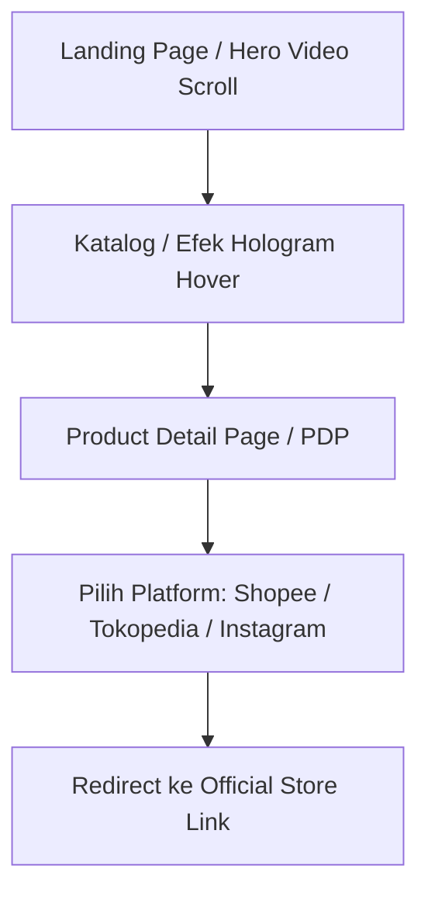

# Design & Technical Specification: Teszta World (Product Showcase & Redirect Edition)

Dokumen ini mendefinisikan visi produk, arsitektur teknis, kebutuhan fungsional dan non-fungsional, serta alur pengerjaan untuk website **Teszta World**. Versi ini disesuaikan khusus untuk **Product Preview & Showcase** yang mengarahkan pembeli langsung ke toko online resmi brand di marketplace dan media sosial.

---

## 1. PROJECT OVERVIEW & OBJECTIVES

### Product Vision
**Teszta World** adalah platform katalog produk fashion avant-garde/antimainstream yang menggabungkan estetika desain futuristik, glitch, dan cyberpunk dengan pengalaman interaktif imersif. 
Tujuan utama website ini adalah:
* **Meningkatkan Kredibilitas & Identitas Brand:** Menampilkan estetika visual premium, misterius, dan interaktif untuk menarik komunitas fashion alternatif.
* **Product Showcase (Showroom Virtual):** Memperlihatkan desain produk pakaian secara visual interaktif (360 derajat) sebelum pengguna membelinya.
* **Direct Marketplace Traffic:** Mengarahkan calon pembeli langsung ke platform penjualan resmi yang sudah terpercaya (Shopee, Tokopedia, Instagram, TikTok) melalui tombol aksi yang jelas dan tautan di footer.

### Scope of Work (Fase 1 - MVP)
Fase pertama difokuskan pada halaman showcase interaktif:
1. **Landing Page Interaktif (Hero Section):** Animasi hero menggunakan video scrubbing yang dikendalikan oleh scroll layar atau gerakan kursor pengguna menggunakan file lokal `aset-testzta.mp4`.
2. **Katalog Produk (Shop Catalog Preview):** Penjelajahan produk dengan efek hologram hover 360 derajat yang futuristik.
3. **Product Detail Page (PDP - Preview):** Halaman spesifikasi produk (galeri gambar, deskripsi, panduan ukuran) yang dilengkapi tombol Call-to-Action (CTA) untuk membeli via Shopee/Tokopedia/Instagram.
4. **Universal Footer & Navigation:** Akses langsung ke platform resmi brand (Shopee, Tokopedia, Instagram, TikTok) di semua halaman.

---

## 2. OFFICIAL STORE LINKS & SOCIAL MEDIA

Seluruh halaman web dan halaman detail produk akan mengarahkan pengguna ke tautan resmi berikut:
*   **Shopee:** [Teszta Studios Shopee](https://shopee.co.id/teszta.studios?categoryId=100011&entryPoint=ShopByPDP&itemId=26575400254)
*   **Tokopedia:** [Teszta World Tokopedia](https://www.tokopedia.com/teszta-world)
*   **Instagram:** [@teszta.world](https://www.instagram.com/teszta.world/)
*   **TikTok:** [@teszta.world](https://www.tiktok.com/@teszta.world)

---

## 3. USER ARCHETYPES & JOURNEY

### User Persona
*   **Nama:** Rian (22 tahun)
*   **Karakteristik:** Gemar mengoleksi pakaian streetwear alternatif, aktif di media sosial, menghargai desain visual unik/antimainstream, dan menyukai pengalaman digital yang interaktif.
*   **Kebutuhan:** Melihat visual produk secara jelas dari segala sudut, dan membelinya dengan aman melalui platform marketplace favoritnya (Shopee/Tokopedia).

### Core User Journey


1. **Discovery (Landing Page):** Pengguna masuk ke halaman utama, disuguhkan dengan animasi video `aset-testzta.mp4` yang berputar secara horizontal mengikuti gerakan scroll layar atau gerakan kursor.
2. **Browsing (Katalog/Shop):** Pengguna menelusuri katalog. Saat kursor diarahkan ke produk (*hover*), muncul proyeksi hologram yang berputar 360 derajat dengan nuansa warna neon/glitch.
3. **Selection (PDP):** Pengguna melihat detail produk, memilih ukuran, membaca deskripsi.
4. **Redirect & Purchase:** Pengguna mengklik tombol "BELI DI SHOPEE" atau "BELI DI TOKOPEDIA" dan langsung diarahkan ke halaman produk resmi untuk menyelesaikan transaksi di platform tersebut.

---

## 4. FUNCTIONAL REQUIREMENTS (Sitemap & Feature List)

Prioritas fitur diklasifikasikan menggunakan metode **MoSCoW** (Must Have, Should Have, Could Have):

| Fitur | Kategori Halaman | Deskripsi | Prioritas |
| :--- | :--- | :--- | :--- |
| **Interactive Video Scrubbing** | Homepage | Mengontrol frame `aset-testzta.mp4` berdasarkan scroll layar atau gerakan kursor dengan transisi inersia yang mulus. | **Must Have** |
| **Hologram Hover Effect** | Catalog/Shop | Memunculkan visualisasi berputar 360 derajat bergaya hologram neon/scanlines saat item katalog di-hover. | **Must Have** |
| **Direct Purchase CTA Redirection**| PDP | Tombol aksi terpisah untuk langsung menuju Shopee, Tokopedia, atau Instagram produk tersebut. | **Must Have** |
| **Universal Footer Links** | Semua Halaman | Footer yang memuat seluruh tautan toko (Shopee, Tokopedia, Instagram, TikTok) dengan ikon/desain cyberpunk yang menarik. | **Must Have** |
| **Responsive Mobile Layout** | Semua Halaman | Penyesuaian penuh untuk perangkat mobile (>80% trafik pengguna). | **Must Have** |
| **Interactive Size-Chart Pop-up** | PDP | Panduan ukuran baju interaktif berbasis pop-up modal. | **Should Have** |
| **Interactive Glitch Transition** | Transisi Halaman| Efek glitch visual saat berpindah halaman. | **Could Have** |
| **Interactive Cursor Glow** | Semua Halaman | Efek kursor bercahaya neon (custom cursor) yang mengikuti gerakan mouse. | **Could Have** |

---

## 5. NON-FUNCTIONAL REQUIREMENTS & TECHNICAL SPECIFICATIONS

### UI/UX Design Guidelines (Cyberpunk Glitch / Avant-Garde Aesthetics)
*   **Warna Utama:** Latar belakang gelap pekat (`#0a0a0a` / `#000000`) dikombinasikan dengan warna aksen neon seperti **Cyan (`#00f0ff`)**, **Neon Green (`#39ff14`)**, atau **Acid Yellow (`#dfff00`)**.
*   **Tipografi:** Menggunakan font Sans-serif modern dan monospace bergaya industrial (contoh: *Outfit*, *Space Mono*, atau *JetBrains Mono* dari Google Fonts).
*   **Efek Hologram:** Menggunakan filter CSS overlay (scanlines menggunakan linear-gradient), bayangan neon ganda (`drop-shadow`), dan sedikit efek distorsi *chromatic aberration* atau glitch halus saat di-hover.

### Performance & Speed
*   **Target Load Time:** Halaman utama harus interaktif dalam waktu **< 2.5 detik** pada koneksi 4G.
*   **Video Optimization:** File `aset-testzta.mp4` dioptimalkan dengan setelan **Keyframe Interval = 1** agar respons *scrubbing* instan tanpa lag. Ukuran file dibatasi maksimal **3MB** (file saat ini $\approx 2.7\text{MB}$ sudah ideal).
*   **Preloading:** Menggunakan state loading kustom bertema cyberpunk selagi browser memuat aset video.

---

## 6. RECOMMENDED TECH STACK & SET UP

Untuk mewujudkan halaman katalog interaktif ini dengan performa optimal:

### Frontend Stack (Modern React SPA)
1. **Framework:** **React (Vite)**. Sangat ringan, cepat, dan mudah dipasang di folder kosong.
2. **Styling:** **Tailwind CSS + Vanilla CSS Custom Utilities** (untuk efek grid scanline, noise overlay, dan neon glow).
3. **Animation Engine:** **GSAP (GreenSock)** dengan **ScrollTrigger Plugin**. Ini untuk mengikat pemutaran video `aset-testzta.mp4` ke posisi scroll secara halus (*inertial smooth scrub*).
4. **Hologram 3D Hover:** Menggunakan rangkaian gambar (Image Sequence 360°) atau video loop melingkar pendek berformat MP4 dengan efek CSS overlay hologram.

### Setup Awal Projek
Langkah-langkah inisialisasi projek baru di dalam folder `d:\Projek Web\teszta-world`:
*   Menggunakan React + Vite + Tailwind CSS.
*   Menginstal GSAP untuk animasi scroll video.

---

## 7. IMPLEMENTATION DETAILS FOR KEY FEATURES

### A. Video Scrubbing on Scroll (Homepage Hero)
Implementasi menggunakan GSAP ScrollTrigger untuk mengikat waktu video dengan pergerakan scroll:

```javascript
import gsap from 'gsap';
import { ScrollTrigger } from 'gsap/ScrollTrigger';

gsap.registerPlugin(ScrollTrigger);

const video = document.querySelector("#hero-video");

// Pastikan metadata video sudah ter-load sepenuhnya sebelum mengikat scroll
video.addEventListener("loadedmetadata", () => {
  gsap.to(video, {
    currentTime: video.duration,
    ease: "none",
    scrollTrigger: {
      trigger: "#hero-section",
      start: "top top",
      end: "bottom bottom",
      scrub: 1, // Memberikan efek inersia/lembut seolah video mengikuti ritme scroll
      pin: true // Mengunci posisi layar saat video berputar
    }
  });
});
```

### B. Catalog Hologram Hover Effect
Efek hologram ketika kursor mengarah ke item katalog:
*   **Aset:** Menggunakan file video loop pendek (misal video berputar 360 derajat berdurasi 2 detik) atau *image sequence* dari produk.
*   **Glow & Scanlines:** Ditambahkan grid diagonal/horizontal tipis menggunakan CSS linear-gradient dan filter warna cyan/teal untuk meniru layar hologram fiksi ilmiah.

---

## 8. RELEASES & FUTURE ROADMAP

### Fase 1: MVP (Preview & Catalog + Marketplace Redirects)
*   Halaman Homepage dengan video-scroll `aset-testzta.mp4`.
*   Halaman Shop Catalog dengan filter & efek hover hologram 360°.
*   Halaman Detail Produk (PDP) dengan galeri, tabel ukuran, dan tombol CTA ke Shopee, Tokopedia, Instagram.
*   Universal Footer berisi tautan lengkap ke toko resmi.

### Fase 2: Skalabilitas (E-commerce Mandiri)
*   Integrasi sistem pembayaran mandiri (Midtrans/Xendit) jika brand ingin mengaktifkan checkout langsung di situs.
*   Peningkatan visual dengan efek WebGL Shader untuk hologram 3D yang lebih nyata menggunakan model file `.gltf`/`.glb`.
